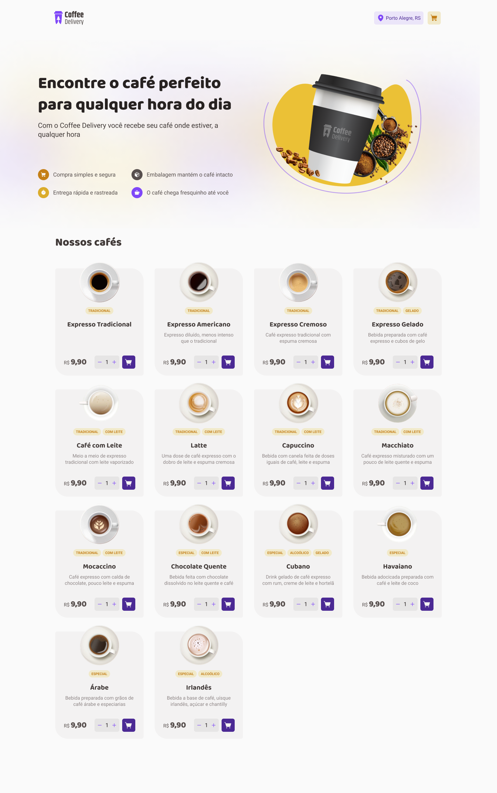

<div align="center">
  
  <div>
    <strong>Coffee Delivery</strong>
  </div>
</div>

## 📝 O que é o Coffee Delivery?

Coffee Delivery é uma aplicação que simula a gestão de um carrinho de compras numa cafetaria fictícia, que contém as seguintes funcionalidades:

- Lista de produtos (cafés) disponíveis para compra
- Adição de itens ao carrinho
- Aumento ou remoção da quantidade de itens no carrinho
- Formulário para o usuário preencher seu endereço
- Exibição de itens totais no carrinho no cabeçalho
- Exibição da soma total de itens no carrinho

## 📷 Demonstração

<div align="center">
  
  
</div>

## 🚀 Tecnologias

✔️ [React](https://reactjs.org/) <br/>
✔️ [Next](https://reactjs.org/) <br/>
✔️ [Redux](https://reactjs.org/) <br/>
✔️ [TypeScript](https://www.typescriptlang.org/)<br/>
✔️ [Tailwind](https://styled-components.com/)<br/>
✔️ [React Hook Form](https://react-hook-form.com/)<br/>
✔️ [Zod](https://zod.dev/)<br/>

## 📁 Como baixar o projeto

```bash
# Clonar o repositório
$ git clone

# Entrar no diretório
$ cd coffee-delivery

# Instalar as dependências
$ yarn ou npm install

# Iniciar o projeto
$ yarn start ou npm run start
```

## 🖊️ Autor

- [@leuzindev](https://github.com/leuzindev)